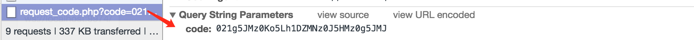

# 微信小程序

## 通过登陆获取 Code
```javascript
// 登录
wx.login({
    success: res => {
        if (res.code) {
          wx.request({
            url: 'https://wechat.3333120.com/Oyxiaoxi/request_code.php',
            data: {
              code: res.code
            },
            method: 'GET', // OPTIONS, GET, HEAD, POST, PUT, DELETE, TRACE, CONNECT
            header: {
              'content-type': 'application/json'
            }, // 设置请求的 header
            success: function(res){
              // success
              console.log(res.data)
            },
            fail: function() {
              // fail
              console.log('获取用户登录态失败！' + res.errMsg)
            }
          })
        }
    }
})
```

## 服务端 PHP 代码
```php
error_reporting(0);
$APPID = '从公众号注册后台获取';
$AppSecret = "从公众号注册后台获取";
$code = $_REQUEST['code'];
$request_https="
https://api.weixin.qq.com/sns/jscode2session?appid=APPID&secret=SECRET&js_code=JSCODE&grant_type=authorization_code";

// 获取session_key和openid的接口地址
// 由 curl_init() 返回的 cURL 句柄。
$ch = curl_init(); 
curl_setopt($ch,CURLOPT_URL,$request_https);
// cURL 从服务端进行验证
curl_setopt($ch,CURLOPT_SSL_VERIFYPEER,FALSE);
curl_setopt($ch,CURLOPT_SSL_VERIFYHOST,FALSE);

curl_setopt($ch,CURLOPT_RETURNTRANSFER,1);

$output = curl_exec($ch);
curl_close($ch);
$jsoninfo = $output;
```



## 用 Code,APPID,AppSecret 交换 session_key,openid
```bash
https://api.weixin.qq.com/sns/jscode2session?appid=APPID&secret=AppSecret&js_code=Code&grant_type=authorization_code
```

> 直接用浏览器带入获得的值，即可获得 session_key，expires_in，openid
